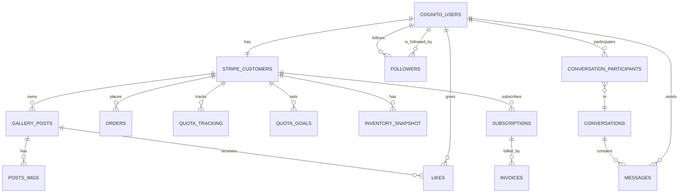

# Database Schema & Data Flow

This document provides a detailed overview of the main database tables, their relationships, and how data flows through the system.

---

## 1. Main Entities & Tables

- **cognito_users**: User profile info (sub, name, email, etc.)
- **stripe_customers**: Business/subscription profile, maps users to Stripe customer records
- **gallery_posts**: Posts (artwork/products) created by users
- **posts_imgs**: Additional images for posts
- **followers**: User follow relationships (many-to-many self-join)
- **likes**: Likes on posts (user ↔ post)
- **conversations**: Messaging conversations between users
- **conversation_participants**: Users in each conversation
- **conversation_visibility**: Per-user visibility for conversations
- **messages**: Individual messages in conversations
- **orders**: Orders for a customer
- **quota_tracking**: Quota products for a customer
- **quota_goals**: Quota goals for a customer
- **inventory_snapshot**: Inventory snapshots for analytics
- **subscriptions**: Stripe subscription records
- **invoices**: Stripe invoice records
- **image_uploads**: Tracks daily image upload limits per customer
- **webhook_events**: Stripe webhook logs
- **failed_transactions**: Stripe failures, etc.

---

## 2. Relationships (Foreign Keys & Structure)

- `cognito_users.sub` ↔ `stripe_customers.aws_sub` (1:1 or 1:0)
- `gallery_posts.customer_id` ↔ `stripe_customers.customer_id` (N:1)
- `posts_imgs.post_id` ↔ `gallery_posts.id` (N:1)
- `followers.follower_id`/`followed_id` ↔ `cognito_users.sub` (M:N)
- `likes.user_sub` ↔ `cognito_users.sub`, `likes.post_id` ↔ `gallery_posts.id`
- `conversation_participants.user_sub` ↔ `cognito_users.sub`, `conversation_participants.conversation_id` ↔ `conversations.id`
- `conversation_visibility.user_sub` ↔ `cognito_users.sub`, `conversation_visibility.conversation_id` ↔ `conversations.id`
- `messages.conversation_id` ↔ `conversations.id`, `messages.sender_sub` ↔ `cognito_users.sub`
- `orders.customer_id` ↔ `stripe_customers.customer_id`
- `quota_tracking.customer_id` ↔ `stripe_customers.customer_id`, `quota_tracking.post_id` ↔ `gallery_posts.id`
- `quota_goals.customer_id` ↔ `stripe_customers.customer_id`
- `inventory_snapshot.customer_id` ↔ `stripe_customers.customer_id`
- `subscriptions.customer_id` ↔ `stripe_customers.customer_id`
- `invoices.customer_id` ↔ `stripe_customers.customer_id`, `invoices.subscription_id` ↔ `subscriptions.subscription_id`

---

## 3. Data Flow Example (User Journey)

1. **Signup/Login**
   - User is created in `cognito_users` (AWS Cognito).
   - On subscription, a `stripe_customers` record is created and linked to the user.
2. **Profile & Business**
   - User profile data is stored in `cognito_users`.
   - Business profile (display name, logo, etc.) is in `stripe_customers`.
3. **Gallery/Posts**
   - User (via their business/customer) creates posts in `gallery_posts`.
   - Each post can have multiple images (`posts_imgs`).
   - Posts can be liked (`likes`), tracked for quotas (`quota_tracking`), and referenced in orders.
4. **Followers & Social**
   - Users can follow/unfollow each other (`followers`).
5. **Conversations**
   - Users can start conversations (`conversations`, `conversation_participants`).
   - Messages are stored in `messages`.
6. **Orders**
   - Orders are created for a customer (`orders`), referencing items/posts.
7. **Quota & Inventory**
   - Quota products and goals are tracked per customer.
   - Inventory snapshots are periodically saved.
8. **Billing**
   - Subscriptions and invoices are managed per customer.
   - Stripe webhooks update these records.

---

## 4. Hierarchy & Structure

- **User** (`cognito_users`)
  - ↳ **Business Profile** (`stripe_customers`)
    - ↳ **Posts** (`gallery_posts`)
      - ↳ **Images** (`posts_imgs`)
      - ↳ **Likes**
      - ↳ **Quota Tracking**
    - ↳ **Orders**
    - ↳ **Quota Goals**
    - ↳ **Inventory Snapshots**
    - ↳ **Subscriptions**
      - ↳ **Invoices**
  - ↳ **Followers**
  - ↳ **Conversations**
    - ↳ **Messages**

---

## 5. Visual ERD (Entity Relationship Diagram)

> **Note:** The one-to-one relationship between `cognito_users` and `stripe_customers` is enforced by unique constraints on both `cognito_users.customer_id` and `stripe_customers.aws_sub` in the schema.

---

For more details, see the models in `lib/models/`.
